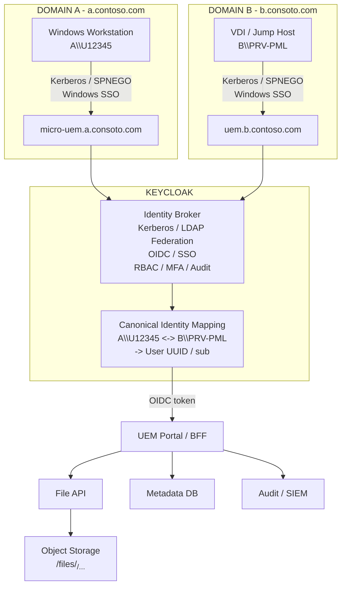

# UEM Secure Transfer

## Identity Federation, Windows SSO, and Self-Provisioning with Keycloak

**Technical Architecture Design Document**  
Target audience: IAM, Cybersecurity, Active Directory, Network, Platform, and Application Engineering teams

| Field | Value |
|---|---|
| Status | Final Proposal / Target Architecture |
| Domain A | `a.contoso.com` |
| Domain B | `b.consoto.com` |
| Example additional Domain C | `c.consoto.com` |
| Web endpoint from Domain A | `https://micro-uem.a.consoto.com` |
| Web endpoint from Domain B | `https://uem.b.contoso.com` |
| Web endpoint from Domain C | `https://uem.c.contoso.com` |
| Identity Platform | Keycloak |
| Date | 21 August 2026 |

> **Architecture Decision**  
> The application identity is decoupled from usernames in every connected Active Directory domain. For example, `A\\U12345`, `B\\PRV-PML`, and `C\\PRV-PML` can be correlated to one stable Keycloak subject used for authorization, file ownership, and audit correlation.

---

# 1. Executive Summary

The solution provides a secure web-based file transfer portal between a Windows workstation in Domain A and a VDI session in Domain B, while providing transparent Windows Single Sign-On, controlled cross-domain identity correlation, and strict per-user content segregation.

Keycloak operates as the **identity abstraction and federation layer** between Active Directory/Kerberos and the UEM application.

Core design principles:

- From the workstation in Domain A, the user is transparently authenticated using the existing Windows logon session through Kerberos/SPNEGO.
- From the VDI session in Domain B, the user is transparently authenticated using the Domain B Windows logon session.
- On the first access from Domain A, if no identity mapping exists, Keycloak initiates a controlled self-provisioning workflow.
- During self-provisioning, the user proves ownership of the corresponding Domain B account by entering the Domain B username and password once.
- Domain B credentials are validated against Active Directory B and are never persisted.
- Only the relationship between the Domain A identity, Domain B identity, and canonical Keycloak identity is persisted.
- The UEM application consumes a canonical OIDC identity and contains no direct Kerberos, LDAP, or Active Directory authentication logic.
- Files are owned by the canonical Keycloak `sub`/UUID rather than by `U12345` or `PRV-PML`.
- Security-relevant operations can be audited using the canonical identity, source identity, source security zone, and file integrity metadata.

> **Guiding Principle**  
> Kerberos establishes **how the user authenticated**. Keycloak establishes **who the user is from the application perspective**. UEM authorizes access and manages data exclusively through the canonical identity.

---

# 2. Context, Constraints, and Requirements

| Element | State / Requirement |
|---|---|
| Domain A client | Windows workstation joined to `a.contoso.com`; example user `A\\U12345` |
| Domain B client | VDI session / jump host joined to `b.consoto.com`; example user `B\\PRV-PML` |
| Domain A URL | `https://micro-uem.a.consoto.com` |
| Domain B URL | `https://uem.b.contoso.com` |
| Domain A identity administration | Managed by a third party; no ability to modify user attributes |
| Domain B identity administration | Controlled by the solution team; users and directory attributes can be read and managed |
| User experience | Transparent SSO on both workstation and VDI after initial provisioning |
| Data segregation | Each canonical user must only be able to access their own file namespace |
| Example identity mapping | `A\\U12345 <-> B\\PRV-PML <-> canonical Keycloak sub/UUID` |

## 2.1 Non-Goals

- Synchronizing or renaming user accounts across the two Active Directory domains.
- Making usernames identical in both Active Directory environments.
- Persisting Domain B passwords in the application or in Keycloak for subsequent authentication.
- Using `sAMAccountName`, UPN, or a directory username as the primary key for file ownership.
- Performing direct peer-to-peer file transfer between the workstation and the VDI session.
- Making UEM directly dependent on Kerberos or LDAP.

---

# 3. Target Logical Architecture



## 3.1 Components

| Component | Responsibility |
|---|---|
| Domain A browser | Transparently presents the Domain A Windows logon context using SPNEGO/Kerberos |
| Domain B VDI browser | Transparently presents the Domain B Windows logon context using SPNEGO/Kerberos |
| Keycloak | SSO, Kerberos integration, LDAP/AD federation for Domain B, canonical identity, A/B identity mapping, OIDC, RBAC/MFA, and identity audit events |
| Custom Provisioning Extension | Keycloak Required Action / Authenticator SPI implementing first-time identity linking and 1:1 mapping enforcement |
| UEM Portal / BFF | Server-side OIDC confidential client; application session management and upload/download orchestration |
| File API | File ownership enforcement, streaming, checksums, policy controls, and anti-malware integration |
| Metadata DB | File metadata, processing state, canonical owner subject, and audit references |
| Object Storage | Encrypted object storage segregated by canonical subject |
| Audit / SIEM | Correlation of login, provisioning, upload, download, deletion, and security events |

---

# 4. Identity Model

The design intentionally separates external directory identities from the application's internal identity key.

Account names are mutable and directory-specific. The Keycloak subject is instead treated as the stable identifier consumed by the application.

```text
External identity A: U12345@a.contoso.com
External identity B: PRV-PML@b.consoto.com
                         |
                         v
Canonical Keycloak user: <UUID / sub>
                         |
                         +-- authorization
                         +-- file ownership
                         +-- audit correlation
```

Logical relationship:

```text
A\\U12345 -----------+
                      |
                      v
               Keycloak User UUID
                      ^
                      |
B\\PRV-PML -----------+
```

## 4.1 Mapping Persistence

For a greenfield implementation, the identity correlation must not depend on attributes in Domain A because those identities are managed externally and cannot be modified by the solution team.

The relationship should be maintained within the Keycloak-controlled identity layer by using either:

1. local Keycloak user attributes; or
2. for stronger consistency, uniqueness, and lifecycle requirements, a dedicated mapping store implemented through a custom Keycloak SPI.

Logical data model:

| Field | Example | Constraint |
|---|---|---|
| `canonical_user_id` | `cef04b42-dcf0-4e41-...` | Immutable |
| `identity_type` | `AD_A` / `AD_B` | Enumerated |
| `principal` | `U12345@a.contoso.com` / `PRV-PML@b.consoto.com` | Normalized and unique within provider scope |
| `linked_at` | UTC timestamp | Auditable |
| `link_method` | `SELF_PROVISIONING_B_CREDENTIAL` | Auditable |
| `status` | `ACTIVE` / `REVOKED` | Administratively controlled |

> **Security Constraint**  
> Identity correlation must be **strictly 1:1**. A Domain A identity can be linked to only one canonical user, and a Domain B identity must not be linked concurrently to multiple Domain A identities.

---

# 5. Authentication and Provisioning Flows

## 5.1 First Access from Domain A

```mermaid
sequenceDiagram
    participant U as User / Domain A Workstation
    participant K as Keycloak
    participant AD as Active Directory B
    participant APP as UEM BFF

    U->>K: Access using Windows session A\\U12345
    K->>K: Kerberos / SPNEGO validation
    K->>K: Lookup A identity -> canonical user mapping

    alt Mapping does not exist
        K-->>U: Self-Provisioning Required Action
        U->>K: B\\PRV-PML + Domain B password
        K->>AD: Validate credentials
        AD-->>K: Success / Failure

        alt Credentials are valid
            K->>K: Create A <-> B <-> canonical sub mapping
            K-->>APP: Establish OIDC session / issue token
        else Credentials are invalid
            K-->>U: Access denied; no mapping is created
        end
    else Mapping already exists
        K-->>APP: Establish OIDC session / issue token
    end
```

Operational sequence:

1. The user accesses `https://micro-uem.a.consoto.com` from a Windows workstation already authenticated as `A\\U12345`.
2. The browser performs SPNEGO negotiation and Keycloak validates the Kerberos ticket, obtaining the Domain A principal.
3. Keycloak checks whether an active canonical mapping already exists for the Domain A principal.
4. If no mapping exists, the authentication flow invokes a custom **Required Action / Authenticator** implementing self-provisioning.
5. The user enters the Domain B username and password only during this step, for example `PRV-PML`.
6. The custom component asks Keycloak's named Domain B User Federation provider to resolve the account and validate the credentials against Active Directory B over an approved protected channel, preferably LDAPS. LDAP connection, bind, search-base, and attribute-mapping configuration belongs to the federation provider, not to custom code.
7. If validation succeeds, Keycloak resolves or creates the canonical identity associated with `B\\PRV-PML` and persists the mapping to `A\\U12345`.
8. The Domain B password is immediately discarded and must not be written to databases, logs, telemetry, traces, or session stores.
9. Keycloak completes the authentication flow and issues the OIDC session/tokens associated with the canonical identity to the BFF.

## 5.2 Subsequent Accesses from Domain A

```text
A\\U12345
    |
    v
Kerberos / SPNEGO
    |
    v
Keycloak
    |
    +-- mapping already exists
    |
    v
canonical sub
    |
    v
OIDC -> UEM BFF -> canonical user's file namespace
```

The user is not prompted for Domain B credentials again.

## 5.3 Access from the VDI Session in Domain B

```text
B\\PRV-PML
    |
    v
Kerberos / SPNEGO
    |
    v
Keycloak
    |
    v
same canonical sub
    |
    v
OIDC -> UEM BFF -> same file namespace
```

## 5.4 Unlink / Relink Lifecycle

The mapping must not be freely modifiable by the end user after initial provisioning.

Identity unlinking and relinking must be governed through one of the following mechanisms:

- a dedicated administrative process; or
- a strongly authenticated / step-up flow;
- comprehensive audit logging; and
- explicit account-takeover protection controls.

After an unlink operation, the next access from Domain A triggers the self-provisioning workflow again.

---

# 6. Keycloak Capabilities Used by the Solution

Keycloak is used as the **identity control plane** of the solution rather than as a simple login front end.

| Capability | Usage in the Architecture |
|---|---|
| Kerberos bridge / SPNEGO | Transparent SSO from Windows sessions in Domains A and B |
| LDAP/AD User Federation | Resolution and validation of Domain B identities; attribute synchronization where appropriate |
| Authentication Flows | Domain-aware browser flows, conditional execution, controlled fallback, and MFA for privileged roles |
| Required Actions / SPI | Initial self-provisioning and custom A/B identity linking |
| OIDC | Standard identity contract between the identity tier and UEM BFF |
| Client Roles / Groups | RBAC for users, administrators, auditors, and security operators |
| Token Exchange | Optional downstream service token scoping with limited audiences and least privilege |
| Events / Observability | Login, logout, authentication errors, and provisioning events exported to the audit/telemetry pipeline |
| Admin Console / API | Governed management of clients, realm configuration, roles, and identity-link lifecycle |

## 6.1 Realm and Client Configuration

- Use a dedicated realm for the solution, unless a shared corporate realm is explicitly justified by governance, tenancy, and blast-radius requirements.
- Configure UEM BFF as an OIDC **confidential client**.
- Use server-side Authorization Code flow.
- Configure explicit redirect URIs for:
  - `https://micro-uem.a.consoto.com/*`
  - `https://uem.b.contoso.com/*`
- Avoid broad wildcard redirect patterns unless strictly required.
- Protect browser sessions with `Secure`, `HttpOnly`, and an appropriate `SameSite` cookie policy consistent with the OIDC redirect model.

## 6.2 Production Active Directory and Windows SSO Configuration

LDAP federation and Windows SSO have separate responsibilities and are used together:

- Configure an LDAP User Federation provider with `Vendor = Active Directory` for directory resolution, attribute mapping, account status, and synchronization. Use `sAMAccountName` as the interactive username attribute and `objectGUID` as the immutable LDAP UUID attribute.
- Enable Kerberos authentication on the LDAP provider so a principal authenticated through SPNEGO can resolve to the corresponding AD-backed user. If Kerberos is not backed by LDAP, use Keycloak's separate Kerberos User Storage provider instead.
- Enable the Kerberos execution in the browser authentication flow. Provision an `HTTP/<keycloak-host>@<AD-REALM>` SPN and keytab for each applicable Keycloak hostname/realm, configure `/etc/krb5.conf`, DNS, TLS, and browser Negotiate allowlists, and protect keytabs as secrets.
- Prefer LDAPS, a least-privilege directory bind identity, `READ_ONLY` edit mode, and externally managed secrets.

Two independent LDAP federation providers do not by themselves correlate an A identity and a B identity into one Keycloak account. The production solution must retain a governed canonical-link mechanism or introduce a central identity-broker/master-identity tier. Persist linkage using immutable domain-qualified identifiers such as `objectGUID`; `sAMAccountName` remains a login/display attribute and must not become the UEM ownership key.

---

# 7. Security Architecture and Threat Model

## 7.1 Self-Provisioning Security Controls

| Risk | Mitigation |
|---|---|
| Account takeover through malicious identity linking | Online verification of Domain B credentials, strict 1:1 mapping, rate limiting, AD-aligned lockout behavior, and security auditing |
| Credential leakage | End-to-end TLS; passwords never persisted or logged; error and telemetry sanitization |
| Credential stuffing | Rate limiting by Domain A principal and source IP, progressive delay, AD risk signals where available, and SIEM correlation |
| Mapping race condition | Atomic transaction / unique constraint on both Domain A and Domain B principals |
| Session fixation | Session rotation after successful provisioning and authentication |
| Identity header spoofing | Do not trust client-supplied identity headers; identity must originate from authenticated protocol context |
| Kerberos downgrade / NTLM prompting | Managed intranet allowlists and SPNEGO configuration; avoid dependence on NTLM fallback |
| Privileged administrator misuse | Segregated RBAC, MFA/step-up for privileged operations, and immutable audit logging of mapping changes |

## 7.2 Password Handling

> **Non-Negotiable Requirement**  
> The Domain B password is a **transient proof-of-possession secret** used only during the initial identity-linking transaction. It must never become an application credential.

Requirements:

- no persistence;
- no logging;
- no exposure in distributed tracing;
- no application-level caching;
- no reuse for subsequent logins; and
- immediate release/zeroization where technically feasible within the selected runtime and framework.

## 7.3 Kerberos Requirements

- Register and maintain the required HTTP SPNs correctly.
- Manage service accounts and keytabs according to the organization's Active Directory security standards.
- Configure Edge/Chrome Integrated Authentication only for explicitly approved origins.
- Validate the actual forest/domain trust and cross-realm Kerberos topology before production implementation.
- Do not delegate Kerberos tickets downstream unless a verified application requirement exists.
- The UEM application itself must never receive or process Kerberos tickets.

---

# 8. UEM Application Architecture

UEM must remain **identity-provider agnostic**.

The BFF validates the OIDC session and propagates a canonical subject internally. No microservice is permitted to perform Domain A/B username lookups to determine object ownership.

```text
Browser
  |
  | secure HttpOnly session cookie
  v
UEM BFF <---- OIDC ----> Keycloak
  |
  +-- File API
  +-- Metadata API
  +-- Audit API
       |
       +-- Metadata DB
       +-- Object Storage
```

## 8.1 File Data Model

| Attribute | Description |
|---|---|
| `file_id` | Application-level immutable file identifier |
| `owner_sub` | Canonical Keycloak subject and authoritative ownership key |
| `object_key` | Opaque object-storage key, preferably derived from `owner_sub + file_id` |
| `original_filename` | User-visible filename; never used for authorization decisions |
| `size` / `content_type` | Technical metadata |
| `sha256` | Integrity verification and audit correlation |
| `status` | `UPLOADING`, `SCANNING`, `AVAILABLE`, `QUARANTINED`, `DELETED` |
| `expires_at` | Optional retention timestamp for temporary content |

Storage key pattern:

```text
/objects/<canonical-sub>/<file-id>
```

Authoritative authorization rule:

```text
request.subject == metadata.owner_sub
```

## 8.2 Upload and Download Processing Pipeline

```text
UPLOAD
Browser
  -> BFF / File API
  -> streaming
  -> quarantine
  -> malware scan
  -> SHA-256 calculation
  -> policy validation
  -> AVAILABLE

DOWNLOAD
Browser
  -> BFF / File API
  -> ownership validation
  -> policy enforcement
  -> audited stream
```

---

# 9. Audit, Logging, and Observability

| Event | Minimum Fields |
|---|---|
| `LOGIN_SUCCESS` / `LOGIN_FAILURE` | `canonical_sub`, `source_principal`, `source_domain`, client, timestamp, result, `correlation_id` |
| `IDENTITY_LINK_CREATED` | `canonical_sub`, Domain A principal, Domain B principal, method, timestamp, actor/source |
| `IDENTITY_LINK_REVOKED` | `canonical_sub`, previous mapping, administrative actor, reason, timestamp |
| `FILE_UPLOAD` | `canonical_sub`, `file_id`, size, SHA-256, source zone, timestamp |
| `FILE_DOWNLOAD` | `canonical_sub`, `file_id`, source zone, timestamp |
| `FILE_DELETE` | `canonical_sub`, `file_id`, actor, reason, timestamp |
| `SECURITY_EVENT` | rate-limit event, malware detection, denied access, suspicious linking attempts |

Operational requirements:

- Separate security audit logs from application debug logs.
- Never log passwords, full access/refresh tokens, Kerberos tickets, or file contents.
- Propagate a `correlation_id` / distributed trace identifier from Keycloak and the BFF to downstream services and the SIEM.
- Integrate OpenTelemetry or an equivalent observability pipeline for metrics, traces, and operational logs.
- Use the SIEM as the authoritative system of record for security-relevant events.

A complete event chain must make the following correlation possible:

```text
A\\U12345
  -> canonical_sub=cef04b42...
  -> UPLOAD file_id=7348
  -> source_zone=A

B\\PRV-PML
  -> canonical_sub=cef04b42...
  -> DOWNLOAD file_id=7348
  -> source_zone=B
```

This proves that the same canonical identity uploaded a file from the Domain A workstation and subsequently downloaded the same file from the Domain B VDI session.

---

# 10. Deployment, High Availability, and Resilience

| Layer | Recommendation |
|---|---|
| Ingress | Redundant reverse proxy / load balancer, TLS termination or passthrough according to policy, health checks, and routing for both FQDNs |
| Keycloak | Minimum two production instances, reproducible configuration, managed secrets, tested backup and restore procedures |
| Keycloak Database | PostgreSQL HA or equivalent platform with PITR and verified backups |
| UEM BFF/API | Stateless where possible, horizontally scalable |
| Metadata DB | HA deployment, backup, retention, and tested recovery procedures |
| Object Storage | Encryption at rest, lifecycle controls, and versioning/immutability where required |
| AV / Sandbox | Redundant scanning service with an explicitly defined failure policy |
| Observability | SLO-based metrics, alerting, audit export, capacity dashboards, and error-rate monitoring |

Reference deployment pattern:

```text
                         Load Balancer
                              |
                +-------------+-------------+
                |                           |
                v                           v
             Keycloak 1                  Keycloak 2
                |                           |
                +-------------+-------------+
                              |
                              v
                         PostgreSQL HA
```

---

# 11. Failure Modes and Expected Behavior

| Scenario | Expected Behavior |
|---|---|
| AD A / Kerberos unavailable | No new SSO from Domain A; no local bypass for standard users unless explicitly approved by policy |
| AD B unavailable during initial linking | Self-provisioning cannot complete; no partial mapping is persisted |
| AD B unavailable after identity linking | A revalidation/freshness policy must define behavior, especially for disabled Domain B accounts |
| Keycloak unavailable | New authentications are blocked; already-established application sessions remain valid only within configured security policy |
| Duplicate identity mapping | Operation is rejected atomically and reported to the SIEM |
| Object Storage unavailable | Upload/download operations are suspended; metadata remains transactionally consistent |
| Malware scanner unavailable | Recommended behavior is `fail-closed` or quarantine for newly uploaded content |

---

# 12. Design Decisions and Items Requiring Validation

| ID | Decision / Question | Status |
|---|---|---|
| D-01 | Keycloak is the canonical identity layer; UEM consumes the `sub` claim as the authoritative user key | Proposed |
| D-02 | Self-provisioning occurs only on the first Domain A access and requires online validation of Domain B credentials | Proposed |
| D-03 | Identity mapping is strictly 1:1 with governed unlink/relink operations | Proposed |
| D-04 | UEM BFF is implemented as a server-side OIDC confidential client | Proposed |
| D-05 | Object ownership is based exclusively on `canonical_sub` | Proposed |
| V-01 | Actual Kerberos topology: forest/domain trust, KDC reachability, SPN ownership | To be validated |
| V-02 | Keycloak User Federation mode for Domain B: user import, edit mode, and synchronization policy | PoC uses `Import Users = OFF`, `READ_ONLY`, no periodic sync; production policy remains to be validated |
| V-03 | Mapping persistence: Keycloak local attributes versus dedicated custom SPI-backed mapping store | Decision required |
| V-04 | Domain B account-disable policy and identity revalidation frequency | Decision required |
| V-05 | File retention, maximum object size, DLP/AV requirements, and data classification | Decision required |
| V-06 | SLO/RTO/RPO targets and VM versus Kubernetes deployment model | Decision required |

---

# 13. Implementation Roadmap

| Phase | Deliverable |
|---|---|
| Phase 1 - IAM PoC | Keycloak, Kerberos for A/B, LDAP federation to B, both FQDNs, OIDC test client, validation of received principals |
| Phase 2 - Self-Provisioning | Required Action / Authenticator SPI, Domain B validation, 1:1 mapping, audit integration, and abuse-case testing |
| Phase 3 - UEM Core | BFF, File API, Metadata DB, Object Storage, and ownership enforcement based on `sub` |
| Phase 4 - Security Pipeline | AV/sandbox integration, rate limiting, SIEM, administrator/auditor RBAC, MFA/step-up authentication |
| Phase 5 - HA & Operations | Keycloak/UEM replication, database HA, backup/restore, dashboards, runbooks, and failure-mode testing |
| Phase 6 - Production Hardening | Penetration testing, threat-model review, load testing, disaster-recovery testing, and operational acceptance |

---

# 14. Security Contract Between Keycloak and UEM

The application identity contract must remain minimal, explicit, and stable.

UEM must not derive ownership from mutable descriptive claims.

Example token/claims payload:

```json
{
  "iss": "https://<keycloak>/realms/uem",
  "sub": "cef04b42-dcf0-4e41-...",
  "preferred_username": "PRV-PML",
  "roles": ["uem-user"],
  "source_domain": "A",
  "source_principal": "U12345@a.contoso.com"
}
```

Claim semantics:

```text
Authoritative for ownership:
  sub

Descriptive / audit context:
  preferred_username
  source_domain
  source_principal
```

`sub` is the only identity attribute that UEM treats as authoritative for file ownership and user namespace authorization.

---

# 15. Technical References

- **Keycloak Server Administration Guide**  
  https://www.keycloak.org/docs/latest/server_admin/  
  LDAP/Active Directory federation, Kerberos/SPNEGO, authentication flows, roles, and user federation.

- **Keycloak Token Exchange**  
  https://www.keycloak.org/securing-apps/token-exchange  
  Token Exchange for service-to-service authorization and audience segmentation.

- **Keycloak Documentation**  
  https://www.keycloak.org/documentation  
  Current Keycloak documentation entry point.

---

# Appendix A - End-to-End Sequence Summary

```text
FIRST ACCESS FROM DOMAIN A

A\\U12345 --Kerberos--> Keycloak
                         |
                         | mapping missing
                         v
                  Self-Provisioning
                         |
                 B\\PRV-PML + password
                         |
                         v
                       AD B
                    valid / invalid
                         |
                      valid
                         |
                         v
              Create canonical mapping

 A\\U12345 <------ <Keycloak sub> ------> B\\PRV-PML
                         |
                        OIDC
                         |
                         v
                       UEM
                         |
                         v
                 /objects/<sub>/...


SUBSEQUENT ACCESS FROM DOMAIN A OR B

Windows session
      |
      v
   Kerberos
      |
      v
   Keycloak
      |
      v
   same sub
      |
      v
     UEM
      |
      v
  same files
```

---

# Appendix B - Acceptance Criteria

- [ ] First access from Domain A with valid Domain B credentials creates exactly one identity mapping and opens UEM without a second application login.
- [ ] First access from Domain A with an invalid Domain B password creates no persistent relationship.
- [ ] After linking, Domain A and Domain B authentication paths resolve to the same canonical subject.
- [ ] A user cannot read, enumerate, or download files owned by a different canonical subject.
- [ ] Domain B passwords and sensitive tokens never appear in application logs, distributed traces, or application databases.
- [ ] Duplicate Domain A or Domain B mappings are rejected atomically.
- [ ] An administrative unlink invalidates the relationship and forces self-provisioning on the next Domain A access.
- [ ] Every upload/download can be correlated to the canonical subject, source identity, timestamp, and file hash.
- [ ] Failure of a single Keycloak or UEM node does not disrupt active sessions beyond the agreed SLO thresholds.

---

# Appendix C - Naming Convention Used in This Document

The names are intentionally simplified according to the requested convention:

```text
Domain A:          a.contoso.com
Domain B:          b.consoto.com
Domain C:          c.consoto.com
Web App from A:    micro-uem.a.consoto.com
Web App from B:    uem.b.contoso.com
Web App from C:    uem.c.contoso.com
```

> **Naming note:** The document intentionally preserves the spelling `consoto.com` wherever it was explicitly specified in the requested naming convention.

---

# Appendix D - Standalone Windows Proof of Concept

A runnable Docker Desktop proof of concept accompanies this document. It is intended for a Windows PC that is not joined to either Active Directory domain.

Because real Windows Integrated Authentication requires a domain account, KDC, SPNs, DNS, browser policy, and usually a domain-joined client, the local PoC substitutes custom Keycloak authenticators at that boundary. Domain A creates or resolves a canonical account. Keycloak then requires at least one directory link and presents a dropdown containing the configured B and C domains. The realm initializer creates separate read-only, non-importing LDAP User Federations using `sAMAccountName`. The custom action targets the selected federation directly, which keeps identical usernames in different domains unambiguous. Each domain-specific identity remains 1:1, while one canonical account can hold links in several domains.

The PoC exposes three web entry points: `http://localhost:8081` for the Domain A workstation and link settings, `http://localhost:8082` for the Domain B VDI, and `http://localhost:8083` for the Domain C VDI. They use separate cookies and OIDC clients while sharing the canonical realm, metadata, and object storage.

Application logout is client-scoped. Each UEM instance clears only its own local cookie and revokes its server-held refresh token through Keycloak, removing that authenticated client session without terminating the parent SSO session or the other UEM client's session. The browser stores only an opaque reference to the server-side token record.

Directory unlink is also client-scoped but applies across all of the canonical user's Keycloak SSO sessions: unlinking Domain B removes every authenticated `uem-b` client session, and unlinking Domain C removes every `uem-c` client session. Other domain clients and `uem-a` remain active. Each rendered authenticated page performs a no-reload heartbeat every 30 seconds. The BFF introspects the server-held refresh token; revocation returns HTTP 401, clears the local session, and causes the browser to return to its entry page. Temporary Keycloak or network failures return HTTP 503 and do not force a browser reload.

The canonical account stores read-only, domain-qualified principals, immutable directory IDs, LDAP DNs, timestamps, method, and aggregate link status. The Domain A web settings page shows B/C link state and launches Keycloak actions to add or remove links. At least one link must remain. Upload requires active status plus at least one domain identity claim. File ownership, download, and CSRF-protected deletion continue to use only the canonical `sub`; nightly cleanup remains unchanged. See [`README.md`](README.md) for the runnable acceptance test.
